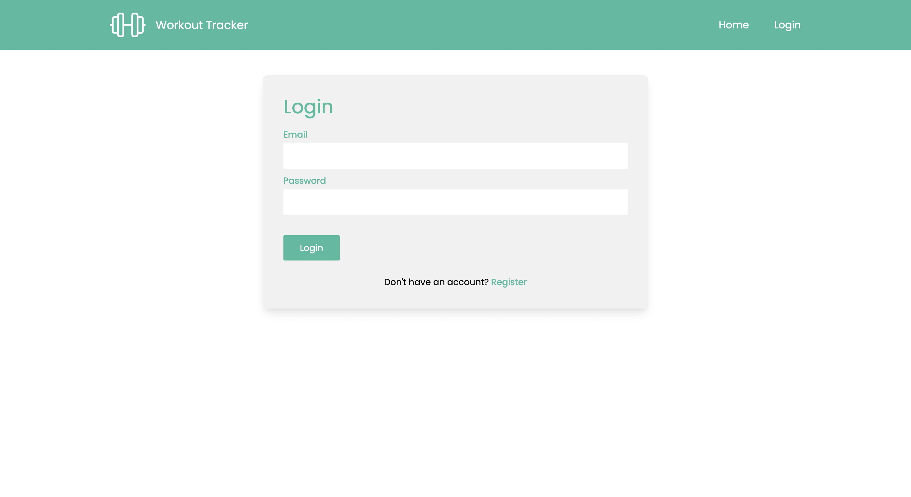

# Workout Tracker App

> An application for tracking workouts with authentication using Vue.js 3 and its composition API together with Supabase. 

## Preview

### Register page


### Login page



### Home page


### Exercise page


## Project setup
```
npm install
```

### Compiles and hot-reloads for development
```
npm run serve
```

### Compiles and minifies for production
```
npm run build
```

### Lints and fixes files
```
npm run lint
```
